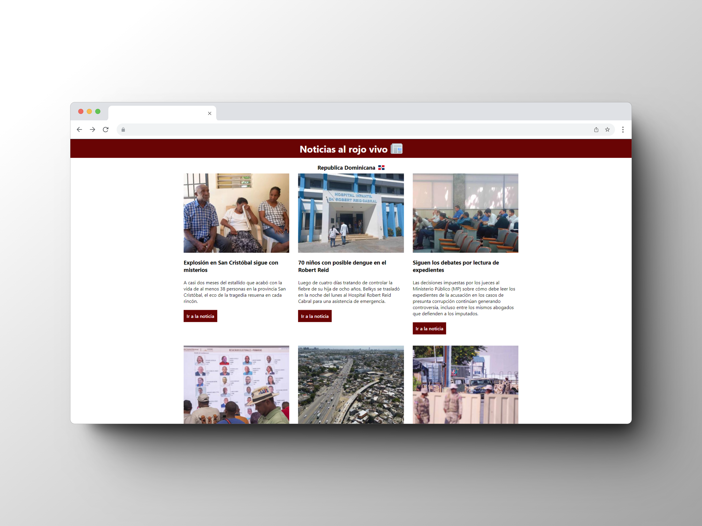
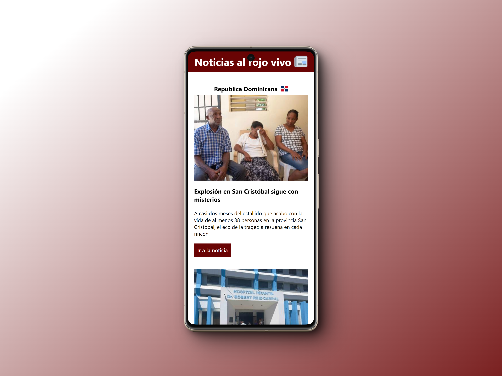

# Noticas al rojo vivo 🔥🗞️

¡Bienvenid@! - Este es un proyecto el cual consiste en traer las noticas del periódico nacional (Diario Libre) a través de web scrapping y estas mostrarlas en mi página.

Este README te servirá para que puedas probar el proyecto donde gustes.

## Tabla de contenido

- [Vista Previa](#vista-previa)
- [Requisitos](#requisitos)
- [Instalación](#instalación)
- [Uso](#uso)

## Vista previa




## Requisitos

Antes de poder utilizar el proyecto asegúrate de que tengas estos programas instalados antes:

- [Node.js](https://nodejs.org/) (cualquier version LTS)
- [Git](https://git-scm.com/) (necesario para que puedas clonar el repositorio)

## Instalación

1. Clona este repositorio en tu maquina:

   ```bash
   git clone https://github.com/louysdev/recreation-loginpage-twitter.git
   ```

2. Entra a la carpeta del repositorio:

   ```bash
   cd recreation-loginpage-twitter
   ```

3. Instalas las dependencias necesarias:

```bash
  npm install
```

## Uso

Para que puedas levantar el proyecto localmente, utiliza este comando

```bash
  npm run dev
```

Ahora, abre el navegador y entra a la siguiente url 'http://localhost:5173' para que puedas ver la pagina. (En el caso de que no te aparezca nada, fíjate en la consola donde levantaste el proyecto, ahi estará la url donde se inicio el proyecto).

##

Happy Hacking!
